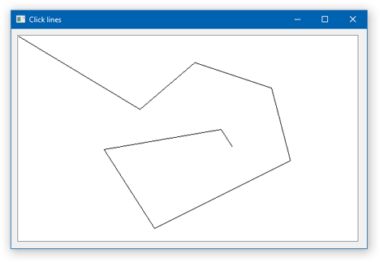

# Click lines

A very simple example of a raw window program, with a child window control, written in native C++11 Win32, using [WinLamb](https://github.com/rodrigocfd/winlamb) library.

Lines will be drawn upon successive clicks.



## WinLamb library

This project uses [WinLamb](https://github.com/rodrigocfd/winlamb) library in a [subtree](http://bluedesk.blogspot.com.br/2017/06/trying-out-git-subtree.html). To add the subtree, run:

```
git remote add winlamb --no-tags https://github.com/rodrigocfd/winlamb.git
git subtree add --prefix winlamb winlamb master --squash
```

If you want to update the library, pull the code from the repo:

```
git subtree pull --prefix winlamb winlamb master --squash
```

### Showcase

The project showcases the following WinLamb features:

* raw main window;
* raw custom control window;
* mouse click events.
